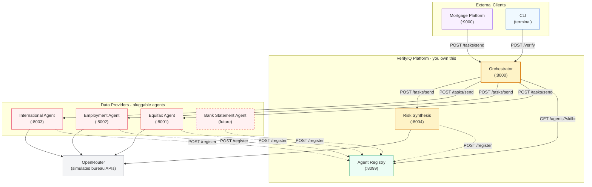
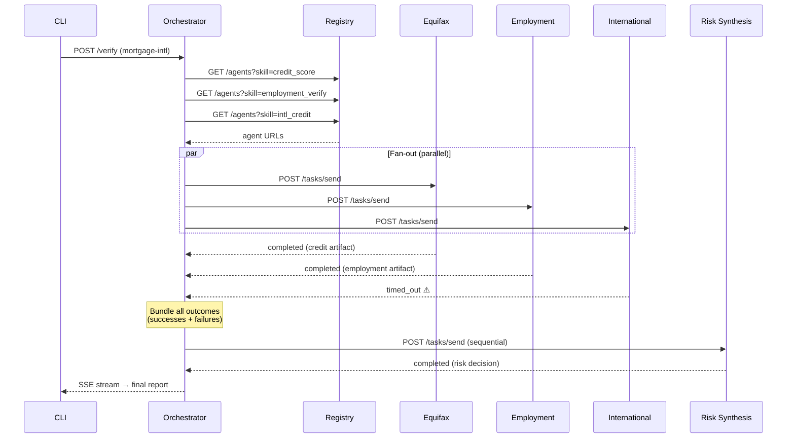
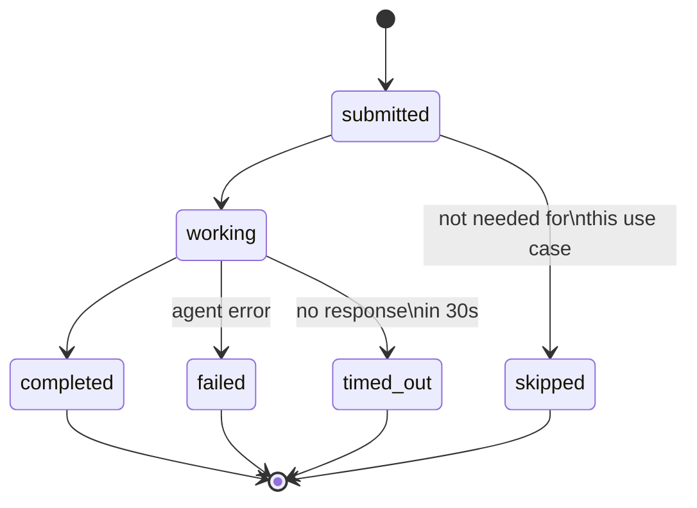
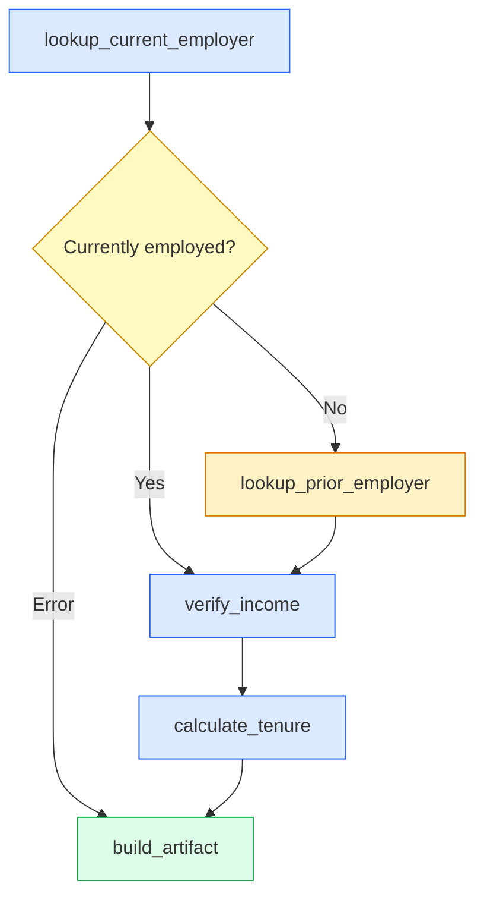
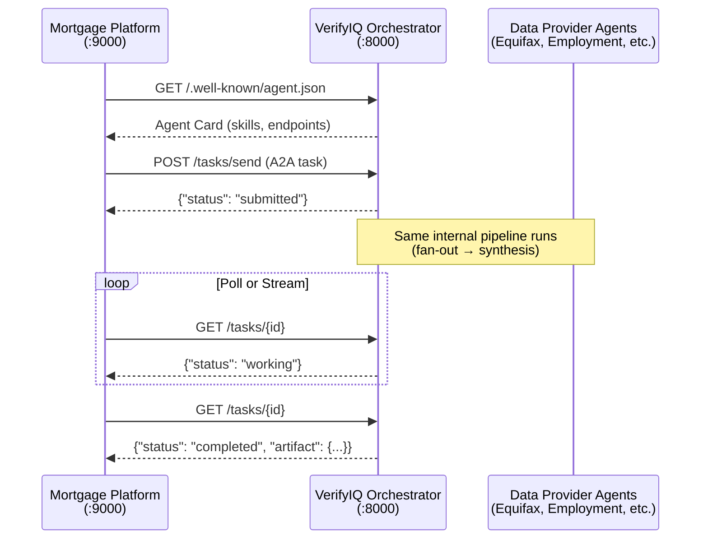
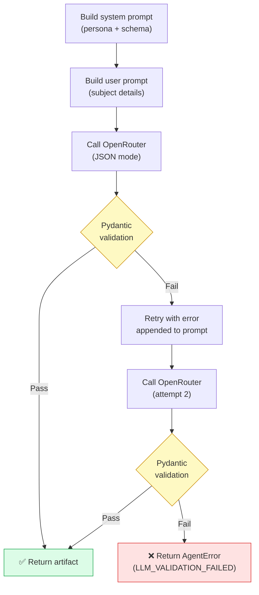

# Most "Multi-Agent" Demos Are Just Function Calls Wearing a Trenchcoat

**I built a platform with 4 LLM-powered agents and 2 infrastructure services — each in its own Docker container, discovered by the orchestrator at runtime through a registry — that still produces a risk decision when agents fail, time out, or return garbage.**

---

Every multi-agent tutorial I've seen follows the same pattern: import Agent A, import Agent B, call A then B, done. They call it "multi-agent." It's just sequential function calls with extra steps.

Real distributed systems don't work that way. Equifax doesn't let you import their credit scoring logic. ADP doesn't share their payroll verification source code. You call their API across a network boundary, get a response — and deal with it when they're slow, wrong, or down entirely.

So I built VerifyIQ — a credit and employment verification platform where each data source is a separate AI agent running in its own container. They register themselves on startup. The orchestrator doesn't know they exist until it asks the registry: *"Who can do credit_score?"*

No hardcoded URLs. No cross-service imports. The agents share Pydantic schemas for the wire protocol, but zero application logic. One agent goes down, the rest keep working. A new provider shows up, it plugs in without touching the orchestrator. And when things break — which they will — the system still produces a decision, just with reduced confidence.

Here's the part I didn't expect: the failure handling was harder than the happy path. By a lot.

Here's what the architecture looks like:



Three tiers. **External clients** (a mortgage platform, a CLI) call VerifyIQ through A2A or plain HTTP. **VerifyIQ's core** — Orchestrator, Registry, Risk Synthesis — handles coordination, discovery, and the final decision. **Data agents** are pluggable: each one simulates what would be a real bureau API in production (Equifax, ADP, Nova Credit). The dashed box is the punchline — adding a new data source means deploying a new container, not changing the orchestrator.

`docker compose up` starts the core platform and all data agents. The Mortgage Platform — an external caller — starts separately with `docker compose --profile uc5 up`, because it represents a different organization. Let's look at what's actually happening inside.

---

## Why Not Just Chain Some LLM Calls?

The simplest version of this is maybe 50 lines of Python. Call an LLM for credit data, call another for employment, call a third to synthesize. Ship it.

But here's the thing — that version breaks the moment you try to do it for real.

In the real world, these data sources are separate companies. Different codebases, different teams, different uptime guarantees:

| Agent | Real-world providers |
|---|---|
| Credit | Equifax, TransUnion, Experian |
| Employment | ADP, Workday, Paychex, The Work Number |
| International Credit | Nova Credit, CRIF, LexisNexis Risk, GBG |

You can't import Equifax's logic into your codebase. You call their API, get a response, and deal with it — including when they're slow, wrong, or completely down.

VerifyIQ models this as a **verification aggregator**. The platform owns three things: the Orchestrator (coordination), Risk Synthesis (decision engine), and the Agent Registry (discovery). The data agents — credit, employment, international — are integration points with external providers. In production, a company like ADP could run their own A2A-compatible agent and self-register it. The Orchestrator wouldn't change — it discovers agents by skill, not by name.

Each agent:

- Runs in its own container
- Has its own LLM prompts and validation logic
- Registers itself with the Agent Registry on startup
- Has zero knowledge of other agents
- Can be replaced, redeployed, or updated independently

The Orchestrator doesn't know agent URLs. It asks the Registry: "Who can do `credit_score`?" and gets an answer at runtime. Deploy a faster credit agent tomorrow, register it, and the Orchestrator routes to it automatically.

That raises an obvious question, though.

---

## "Wait, Where Does the Data Actually Come From?"

Fair question. There are no real Equifax or ADP APIs here. Each agent uses an LLM (via OpenRouter) to generate realistic but fictional data. The credit agent prompts an LLM with a subject's persona and gets back a plausible FICO score, open accounts, utilization percentage, derogatory marks. Employment does the same for income and tenure. International generates foreign credit profiles with local scores mapped to US equivalents.

Why not just hardcode fake data? Two reasons:

1. **Hardcoded stubs return the same thing every time.** LLM-generated data varies per subject, so Risk Synthesis actually has interesting decisions to make. A high-credit-score person with stable employment gets a different outcome than someone with derogatory marks and a recent job change.

2. **The code is identical either way.** In production, each agent calls a real bureau API and parses the response. Here, it calls an LLM and parses the response. The surrounding code — validation, retry on bad data, error handling, structured output — doesn't change. Swap the LLM call for a real API call, and the agent's architecture stays the same.

The data source isn't the point. What matters is everything *around* the data: how agents validate it, how the Orchestrator handles it when it fails, how Synthesis reasons over partial results. That's where the real engineering lives. And it works the same regardless of whether the data came from an LLM or Equifax's actual API.

Now let's look at the protocol that ties it all together.

---

## The A2A Protocol: How Agents Talk

The protocol is simple on purpose. The Orchestrator sends a task, the agent does work, returns a result. Two types handle the whole thing:

```python
class A2ATask(BaseModel):
    task_id: str
    correlation_id: str    # same across ALL tasks in one request
    skill: str             # what you want the agent to do
    input: dict
    timeout_ms: int = 30000
    attempt: int = 1       # 1 = first try, 2 = retry

class A2ATaskResult(BaseModel):
    task_id: str
    correlation_id: str
    status: Literal["completed", "failed", "timed_out"]
    artifact: dict | None
    error: AgentError | None
    started_at: str
    ended_at: str
```

Every agent exposes `POST /tasks/send` and `GET /tasks/{task_id}`. That's the entire contract. The Orchestrator doesn't care if the agent uses LangGraph, a simple function, or a hamster wheel internally. It sends a task, gets a result.

The `correlation_id` is critical — it's the same UUID across every task in a single verification request. When something goes wrong, one grep across all container logs reconstructs the entire execution trace:

```bash
docker compose logs | grep "corr-abc123"
```

No distributed tracing system needed. One ID, everywhere.

So far, so boring. The interesting part is what happens when you need three agents at once — and one of them doesn't come back.

---

## Fan-Out: Calling Agents in Parallel

A mortgage verification needs credit, employment, and international data. Calling them sequentially means 30+ seconds of waiting. Calling them in parallel means you wait only as long as the slowest agent.



```python
async def dispatch_one(skill, agent_name, required) -> AgentOutcome:
    agent_url = skill_urls[skill]
    a2a_task = A2ATask(
        task_id=str(uuid.uuid4()),
        correlation_id=correlation_id,
        skill=skill,
        input=body.model_dump(),
    )
    return await dispatcher.dispatch(agent_url, a2a_task, agent_name)

# Fire all three simultaneously
parallel_outcomes = await asyncio.gather(
    *[dispatch_one(skill, name, req) for skill, name, req in plan["parallel"]]
)
```

`asyncio.gather` dispatches all tasks concurrently. The test suite verifies all parallel agents start within 2 seconds of each other — genuinely concurrent, not accidentally sequential.

But parallel execution creates a new problem: what do you do when one of those parallel tasks doesn't come back?

---

## The Part That Took the Longest: Handling Failure

In demos, everything works. In reality, agents fail, time out, and return garbage. This section took longer than all the others combined. The design rule: **always produce a report, even when things go wrong.**

The system tracks four distinct task statuses:



`timed_out` and `failed` are deliberately separate. A timeout means the infrastructure hiccupped — don't penalize the person being verified. A failure might mean bad data or a logic error — that's a genuine data gap.

When results are collected, the Orchestrator packages everything — successes AND failures — into an outcome bundle:

```python
[
    { "agent": "equifax",    "status": "completed", "artifact": {...} },
    { "agent": "employment", "status": "completed", "artifact": {...} },
    { "agent": "intl",       "status": "timed_out", "artifact": null,
      "error": { "code": "TIMEOUT", "message": "...", "retryable": true } }
]
```

This entire bundle goes to the Risk Synthesis agent. The synthesis LLM prompt explicitly teaches the model how to reason over partial data:

```
Outcome status interpretation:
- "completed" -- use the artifact data for your analysis
- "timed_out" -- transient infrastructure issue; reduce confidence;
                 do NOT penalise the subject
- "failed"    -- data gap; note in risk_flags; reduce confidence
- "skipped"   -- agent was not invoked; do not mention it
```

The result? When the international agent times out, the system doesn't crash or return nothing. It says: "Can't assess foreign credit risk at this time. Confidence reduced. Recommend manual review." That's what a real risk analyst would say — and it's what the LLM says too, because the prompt teaches it to reason that way.

This is the part most multi-agent tutorials skip entirely. Getting agents to work is easy. Getting the *orchestrator* to handle their failures gracefully is the real engineering.

---

## LangGraph Inside an A2A Agent

Most agents are simple: get a task, call an LLM, return a result. The Employment agent isn't. Employment verification has real branching logic: check if someone is currently employed. If not, look up the prior employer. Then verify income, calculate tenure.

LangGraph handles this well — stateful graphs with conditional edges:



```python
graph = StateGraph(EmploymentGraphState)

graph.add_node("lookup_current_employer", lookup_current_employer)
graph.add_node("lookup_prior_employer", lookup_prior_employer)
graph.add_node("verify_income", verify_income)
graph.add_node("calculate_tenure", calculate_tenure)
graph.add_node("build_artifact", build_artifact)

graph.set_entry_point("lookup_current_employer")

def route_after_employer_check(state):
    if state.get("error"):
        return "build_artifact"      # short-circuit on error
    if state.get("currently_employed"):
        return "verify_income"       # skip prior employer lookup
    return "lookup_prior_employer"   # fallback path

graph.add_conditional_edges(
    "lookup_current_employer",
    route_after_employer_check,
    {...}
)
```

But here's the key: **the Orchestrator has no idea LangGraph is involved.** It sends `POST /tasks/send` to the Employment agent and gets back an `A2ATaskResult`. Whether that agent uses LangGraph, a simple function, or three LLM calls in a row is an internal implementation detail.

This is the payoff of A2A: framework-agnostic interop. The credit agent is plain FastAPI. The employment agent is LangGraph. From outside, they look identical. Nobody cares what's inside.

---

## The Registry: How Agents Find Each Other

Every agent registers itself on startup:

```python
@asynccontextmanager
async def lifespan(app: FastAPI):
    # Startup: register with the Registry
    async with httpx.AsyncClient() as client:
        await client.post(f"{registry_url}/register", json={
            "name": "Equifax Credit Agent",
            "url": "http://equifax:8001",
            "skills": ["credit_score", "tradeline_summary", ...],
            ...
        })
    yield
    # Shutdown: deregister
    async with httpx.AsyncClient() as client:
        await client.delete(f"{registry_url}/agents/{url_hash}")
```

The Orchestrator resolves skills to URLs at runtime, picking the fastest healthy candidate:

```python
class AgentResolver:
    async def find(self, skill: str) -> str:
        response = await client.get(
            f"{self.registry_url}/agents", params={"skill": skill}
        )
        candidates = [a for a in response.json() if a["health"] == "healthy"]
        # Prefer agents with lower observed latency
        candidates.sort(key=lambda a: a.get("avg_latency_ms") or float("inf"))
        return candidates[0]["url"]
```

After every dispatch, the Orchestrator reports the observed latency back to the Registry. The Registry maintains an exponential moving average, so recent performance is weighted more heavily. Over time, if two agents both advertise `credit_score`, the Resolver naturally routes to the faster one.

No agent URL is ever written in the Orchestrator's code. This means:

- Deploy a new agent with a relevant skill → it's immediately available
- Replace an agent → the Orchestrator picks it up on the next request
- A faster agent appears → it gradually wins more traffic as its latency average drops
- An agent goes down → it deregisters on graceful shutdown; the Orchestrator doesn't try to call it

This is where the aggregator model pays off. Say a bank wants to add bank statement analysis as a new data source. A third-party provider — or an internal team — builds a new agent that advertises a `bank_statement_analysis` skill. It registers with the Registry on startup. The discovery is automatic — the Orchestrator can find the new agent immediately. You still need to add the new skill to the relevant use case routing plans (a few lines in `get_agent_plan()`), but no other Orchestrator logic changes. No redeployment of existing agents. The Registry is the integration surface — new providers plug into it.

Competing providers work too. If both Equifax and TransUnion register agents advertising `credit_score`, the Resolver picks the faster, healthier one. Switching providers is a configuration concern, not a code change.

That handles the backend. But the pipeline takes 10-30 seconds, and nobody wants to stare at a blank screen.

---

## SSE Streaming: Live Progress, Not Spinners

Without live progress, you submit a request and wait. The Orchestrator fixes this by streaming Server-Sent Events at every milestone:

```
agents_resolved     → "Found 3 agents for this request"
agent_started       → "Dispatching to Equifax..."
agent_completed     → "Credit report received"
agent_completed     → "Employment verified"
agent_failed        → "International agent timed out"
synthesis_started   → "Running risk synthesis..."
synthesis_completed → "Decision: approve (confidence: high)"
completed           → Full report available
```

The CLI renders these as a live timeline in the terminal using Rich.

### Late connectors and replay

What if a client opens the stream after the pipeline is already half-done? They'd miss earlier events.

The solution: every SSE event is persisted to SQLite as it's emitted. When a client connects — whether midway or after completion — the streamer first replays all past events from the database in order, then switches to the live in-memory queue for new events. A client that connects after the pipeline finishes gets a pure database replay. No events are ever lost, regardless of when you tune in.

Live streaming is single-consumer — the in-memory queue is consumed destructively, so only one client can follow a running pipeline in real time. Supporting multiple live consumers would require a pub/sub pattern (one queue per subscriber) instead of one shared queue. For this project, that's fine: the CLI is the only consumer. Completed requests can be replayed by any number of clients since replay reads from SQLite, not the queue.

SSE is standard HTTP — any web frontend could consume it via the browser's `EventSource` API. The Orchestrator doesn't care who's listening.

So far, the Orchestrator has been calling *out* to agents. But what happens when someone calls *you*?

---

## The Orchestrator as an A2A Server: When Someone Calls You

In production, a mortgage company wouldn't run a CLI command. They'd call VerifyIQ programmatically — discover capabilities, submit a task, poll for results. This is the Orchestrator's *callee* role: receiving A2A tasks from services you don't control.

I built this as a separate Mortgage Platform service — a plain FastAPI + httpx app at `:9000` that has **zero imports** from VerifyIQ's codebase. It only knows the A2A wire protocol:



The implementation is surprisingly small. Three new endpoints on the Orchestrator (~60 lines of FastAPI):

1. **`POST /tasks/send`** — accepts the external task, maps its task ID to an internal one, starts the same `run_verification()` pipeline used by the CLI, returns `{"status": "submitted"}` immediately.
2. **`GET /tasks/{id}`** — looks up the internal state, returns status + artifact when complete.
3. **`GET /tasks/{id}/stream`** — forwards internal SSE events to the external caller using the same `SSEStreamer`.

The external task ID mapping is an in-memory dict — external caller's UUID maps to an internal UUID and correlation ID. The caller never sees VerifyIQ's internal IDs; it uses its own task ID for all operations.

The key insight: I'd already built all the hard pieces (`TaskManager`, `SSEStreamer`, `run_verification`) for the outbound side. The inbound side reuses them directly. The same pipeline runs regardless of whether the request came from the CLI or an external platform.

The Mortgage Platform service itself is ~100 lines of FastAPI + httpx. It discovers VerifyIQ via the Agent Card, builds an A2A task, submits it, and polls until done. Docker Compose runs it with `profiles: [uc5]` so it doesn't start by default.

Two independent services, zero shared code, collaborating through a protocol contract. The Mortgage Platform has no idea Equifax, LangGraph, or OpenRouter exist. It just knows VerifyIQ advertises `verify_subject` and returns a `VerificationDecision`.

But all of this only works if the LLMs produce clean data. They don't — at least not on the first try.

---

## Structured Output: Making LLMs Behave

Every data agent follows the same pattern:



The retry-with-correction step is surprisingly effective:

```python
async def retry_with_correction(raw_json, error_msg, seed):
    """Re-prompt the LLM with the validation error so it can self-correct."""
    correction_prompt = (
        f"Your previous output failed validation:\n{error_msg}\n\n"
        f"Fix the JSON and return ONLY valid JSON matching the schema."
    )
    # Call LLM again with the error context
    ...
```

Most validation failures are trivially fixable — a missing field, a score out of range, a date in the wrong format. The LLM reads the Pydantic error and self-corrects on the second try.

Pydantic schemas enforce the data contracts:

```python
class EquifaxArtifact(BaseModel):
    credit_score: int = Field(..., ge=300, le=850)
    credit_utilization_pct: float = Field(..., ge=0, le=100)
    derogatory_marks: int = Field(..., ge=0)
    # ...
```

Credit score of 950? Pydantic catches it. String instead of int? Caught. The schema is the contract, and it's enforced at every boundary.

With clean data flowing, the last question is: which agents run for which request?

---

## Use Case Routing: Not Every Agent Runs Every Time

Not every verification needs every agent. A rental screening doesn't need international credit data. An international hire doesn't need Equifax.

```python
def get_agent_plan(use_case, has_foreign_addr):
    if use_case == "mortgage":
        parallel = [equifax, employment]
        if has_foreign_addr:
            parallel.append(intl)
        return {"parallel": parallel, "sequential": [synthesis]}

    if use_case in ("rental", "auto"):
        return {"parallel": [equifax, employment], "sequential": [synthesis]}

    if use_case == "hire":
        return {"parallel": [employment, intl], "sequential": [synthesis]}
```

Skills not in the plan are marked `skipped` — not `failed`, not just absent. This distinction matters because Risk Synthesis needs to know: "I didn't get international credit data because it wasn't requested" vs. "I didn't get it because the agent crashed."

Skipping happens at the **skill level**, not the agent level. If three agents all advertise `credit_score` and the use case doesn't need credit data, Synthesis sees one outcome: `credit_score: skipped`. Not three skipped agents. Synthesis reasons about data categories — "did I get credit data?" — not about which agents exist in the registry.

---

## Why a CLI Instead of a Web UI?

VerifyIQ uses a terminal CLI built with Typer and Rich. No web frontend. On purpose.

The learning goal is backend: A2A orchestration, agent coordination, failure handling. A web UI would have added React, state management, and deployment complexity — none of which teaches multi-agent patterns. The CLI gives live streaming, rich tables, and formatted reports with zero frontend overhead.

A CLI is the better tool when:

- **Your users are developers or technical operators.** Loan officers would need a web UI. But engineers debugging an agent pipeline, running verification scenarios, or inspecting audit trails work faster in a terminal.
- **The product is a backend service, not a consumer app.** VerifyIQ's real "product" is the Orchestrator's API. The CLI is a client that exercises that API. A web UI would be *another* client of the same API — it doesn't replace the CLI, it supplements it.
- **You need scriptability.** `verifyiq run mortgage-intl --json | jq '.decision'` pipes into any Unix tool. A web UI can't do that.
- **You want fast iteration on backend changes.** No build step, no bundling, no browser refresh. Change the Orchestrator, restart it, run a CLI command, see results immediately.

For a real product with non-technical users, you'd need a web UI. But the same SSE endpoint that powers the CLI could drive a browser dashboard via `EventSource` with no backend changes. The backend doesn't care who's consuming the stream.

---

## Stuff That Bit Me

### LLMs don't follow instructions as well as you think

Even with `response_format: { type: "json_object" }`, LLMs will occasionally:

- Add a field that isn't in the schema
- Return a credit score of 1200 (valid JSON, invalid data)
- Wrap the JSON in markdown code fences
- Mix up date formats

Defense in depth: `response_format` as a first pass, Pydantic as a strict second pass, one retry with the error for self-correction. Two chances. If it fails twice, return a structured error and let Synthesis deal with the gap.

### You can't unit test distributed behavior

The interesting behavior is agents interacting across HTTP. My approach:

- **Mock only the LLM** (using `respx` to intercept OpenRouter calls)
- **Don't mock the Registry or A2A protocol** — test with real HTTP calls
- **Phase the tests** — test the Registry alone, then the protocol alone, then orchestration patterns, then end-to-end flows

The most critical tests are the orchestration pattern tests: does fan-out actually run concurrently? Does a timeout produce the right status? Does the correlation ID survive the full pipeline? These catch the bugs that matter.

### Too many frameworks, not enough thinking

LangGraph, MCP, A2A, plain functions — the temptation is to use everything everywhere. One question cuts through it: "Does this cross an organizational or deployment boundary?"

- **A2A** between services — all inter-agent communication across process/network boundaries
- **LangGraph** inside an agent — when internal logic needs stateful branching or conditional paths (the Employment agent's "currently employed?" fork). It can also handle retries, checkpointing, and human-in-the-loop, though VerifyIQ doesn't need those yet
- **Plain functions** — the default for straightforward, linear logic. VerifyIQ's agents use plain typed Python functions for their internal tools — same pattern as MCP tools, without the wire protocol overhead
- **MCP** at the tool boundary — when you need to standardize tool access (schemas, permissions, portability) across runtimes or teams. VerifyIQ doesn't use MCP since all tools are internal to single agents, but in a production system where tools are shared across teams, MCP would replace the plain functions

Rule of thumb: start with functions. Promote to LangGraph when you need stateful branching. Promote to A2A when you cross service boundaries. Don't promote preemptively.

### "Why didn't you use Google ADK?"

ADK provides A2A server handling out of the box — task lifecycle, SSE, Agent Cards. But it's a full agent framework, not an A2A library. It wants to own your runtime and is tied to Google's ecosystem (Gemini, Vertex AI). VerifyIQ is model-agnostic — LLMs are swapped via env vars through OpenRouter.

More importantly, the A2A server code I needed turned out to be ~80 lines of plain FastAPI. The patterns I'd already built for the outbound side worked in reverse. There was nothing left for ADK to abstract.

ADK makes sense in Google's ecosystem when you don't need to understand protocol internals. For a project whose point *is* understanding those internals, it would have hidden the parts I wanted to learn.

### Docker networking will confuse you

Services inside Docker Compose talk by container name (`http://equifax:8001`), but the CLI runs on the host and needs `http://localhost:8000`. Agents register with their Docker-internal URL. The CLI talks only to the Orchestrator on `localhost:8000`. One gateway in, Docker handles the rest.

---

## The Stack

| Layer | Tech | Why |
|---|---|---|
| CLI | Python + Typer + Rich | Scriptable, fast iteration, no frontend build step |
| Orchestrator | FastAPI | Hub routing; inbound + outbound A2A in plain FastAPI + httpx |
| Mortgage Platform | FastAPI + httpx | External A2A caller (UC-5); protocol-only, no shared code |
| Data agents | FastAPI (Employment: LangGraph) | Pluggable provider adapters; simulate Equifax, ADP, Nova Credit |
| LLM routing | OpenRouter | One key, multiple models, swap via env var |
| Schemas | Pydantic | Strict validation at every service boundary |
| Database | SQLite | Zero-ops; single writer per DB; swap for Postgres later |
| Deployment | Docker Compose | One command, seven services (Mortgage Platform opt-in via profile) |

Everything runs on a laptop. No cloud, no Kubernetes.

---

## What I'd Do Differently (And You Should Do First)

**Start with the protocol, not the agents.** I wish I'd spent the first day defining A2A types and writing protocol tests with hardcoded stubs. Getting the task lifecycle right — especially `timed_out` vs `failed` — mattered more than any LLM prompt.

**Add circuit breakers earlier.** If an agent fails repeatedly, the Orchestrator still retries every time. A circuit breaker that temporarily skips known-bad agents would prevent cascading slowdowns. I knew this going in and still didn't prioritize it.

**Structured logging from day one.** I added `structlog` later and had to retrofit `correlation_id` into existing log calls. If every log line had been JSON with `correlation_id` from the start, debugging would have been smoother the whole way through.

---

## This Isn't Just Credit Verification

The platform is simulated. The patterns aren't. The same architecture applies anywhere you fan out to multiple providers and synthesize results under time pressure: insurance claims (medical records + police reports + repair estimates), supply chain compliance (factory audits + shipping logs + customs data), KYC onboarding (identity + sanctions screening + PEP checks). Swap the LLM prompts and Pydantic schemas, and the orchestration layer works unchanged.

The aggregator model is the key insight. VerifyIQ's value isn't in owning data — it's in orchestrating it. New data source? Deploy a container, register a skill, add a line to the use case routing plan. A bank statement agent, a sanctions screener, a social media risk scorer — they all plug in the same way. The Orchestrator's core logic — discovery, fan-out, failure handling, synthesis — stays untouched.

And the callee pattern means any service that runs an internal pipeline behind a protocol contract can be embedded as a sub-agent in a larger system. The Mortgage Platform proves it: VerifyIQ's entire pipeline is invisible to the caller. It sends a task, gets a decision.

---

## What I Actually Learned

If you're building multi-agent systems:

1. **Design for failure first.** Your happy path will work. The interesting problems are: what happens when one agent is slow? When it returns garbage? When it's down entirely? Design the outcome types and error handling before writing any LLM prompts.

2. **The organizational boundary rule is real.** If different teams will own different agents, you need a protocol (like A2A), not shared code. If one team owns everything, a simple function call is fine. Don't over-engineer boundaries that don't exist, and don't under-engineer boundaries that do.

3. **Correlation IDs are the cheapest observability you'll ever add.** One UUID flowing through everything gives you 80% of what a distributed tracing system gives you, at 1% of the setup cost.

4. **LLMs need schema enforcement at the boundary.** Don't trust LLM output. Validate with Pydantic (or equivalent). Retry once with the error. Fail gracefully on the second attempt. This pattern is boring and reliable.

5. **Partial results beat no results.** Users would rather see "3 out of 4 data sources available, confidence reduced" than a generic error screen. Design your synthesis layer to reason over incomplete data.

6. **Building both sides of the protocol teaches you the whole protocol.** It's easy to build a caller — dispatch tasks, collect results. But adding the callee side (~60 lines of FastAPI) completes the picture: now you understand task lifecycle from the receiver's perspective, external-to-internal ID mapping, and how your SSE streamer serves consumers you don't control. If you're learning A2A, build both directions.

The source is on GitHub. `docker compose up`, install the CLI, run `verifyiq run mortgage-intl`. Watch agents register, get discovered, fan out in parallel, and produce a risk decision — or watch one time out and see what happens next. That second scenario is the interesting one.

---

*Built with Python, FastAPI, LangGraph, OpenRouter, and too many hours staring at `docker compose logs | grep correlation_id`.*
